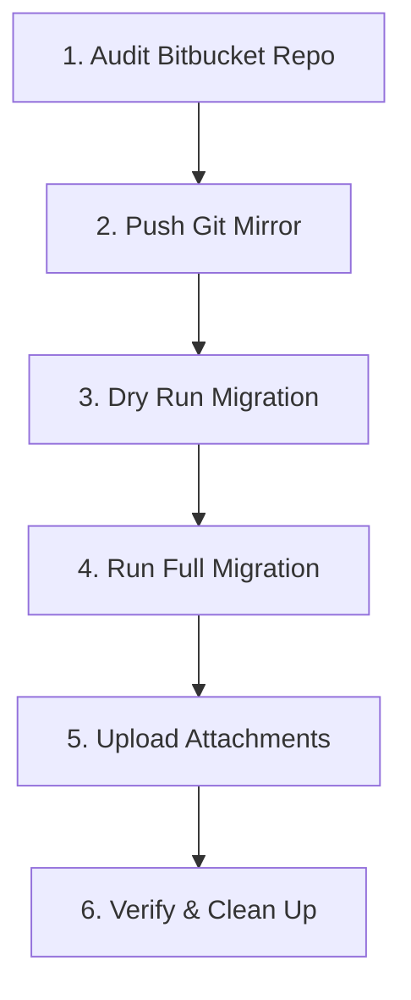

# Bitbucket → GitHub Migration Guide

**Version:** 2.0  **Last Updated:** 2025-10-18

---

## 🤩 Overview

This guide explains how to migrate a Bitbucket **Cloud** repository to **GitHub**, preserving:

* Git history (branches, tags, commits)
* Issues, pull requests, and comments
* Attachments (manual upload required)
* Author and timestamp metadata (as text)

---

## 🧱 Migration Phases



| Phase             | Purpose                          | Output                                     |
| ----------------- | -------------------------------- | ------------------------------------------ |
| 1. Audit          | Collect metadata & create config | `audit_report.md`, `migration_config.json` |
| 2. Git Mirror     | Copy commits, branches, tags     | GitHub repo populated                      |
| 3. Dry Run        | Validate config & API access     | Console logs                               |
| 4. Full Migration | Migrate issues, PRs, comments    | `migration_mapping.json`                   |
| 5. Attachments    | Upload manually                  | GitHub comments + uploaded files           |
| 6. Verification   | Compare counts, finalize         | Checklist complete                         |

---

## 🛠️ Prerequisites

### Required Tools

* Python **3.7+**
* Git **2.x+**
* `pip install requests`

### Required Accounts & Tokens

* **Bitbucket Cloud API Token** (read access to repos, issues, PRs)
* **GitHub Personal Access Token (PAT)** with `repo` scope
  → [Create PAT](https://github.com/settings/tokens)

### Local Setup

```bash
git --version
python3 --version
pip install requests
```

---

## ⚙️ Step-by-Step Migration

### Step 1 — Run Audit

Generates the initial configuration and user mapping.

```bash
python audit_bitbucket.py \
  --workspace WORKSPACE \
  --repo REPO \
  --email YOU@DOMAIN \
  --generate-config \
  --gh-owner GITHUB_USER \
  --gh-repo REPO
```

**Outputs**

* `audit_report.md` – summary of repo data
* `migration_config.json` – template for migration
* `user_mapping_template.txt` – list of contributors

**Next:** Edit the config file to map Bitbucket users to GitHub accounts.
See [User Mapping Reference](reference/user_mapping.md).

---

### Step 2 — Prepare GitHub Repository

1. Create an **empty** repository on GitHub.
   Do *not* add a README or license.
2. Keep it **private** until migration is complete.

---

### Step 3 — Migrate Git History

```bash
git clone --mirror https://bitbucket.org/WORKSPACE/REPO.git
cd REPO.git
git remote add github https://github.com/OWNER/REPO.git
git push --mirror github
```

Verify:

```bash
git ls-remote github
```

---

### Step 4 — Dry Run Migration

```bash
python migrate_bitbucket_to_github.py \
  --config migration_config.json \
  --dry-run
```

Check for:

* Token authentication success
* Valid user mappings
* Correct issue/PR counts
  If errors occur, see [Troubleshooting](troubleshooting.md).

---

### Step 5 — Run Full Migration

```bash
python migrate_bitbucket_to_github.py \
  --config migration_config.json
```

**Outputs**

* Migrated issues and PRs (open PRs remain PRs; closed PRs become issues)
* Downloaded attachments in `attachments_temp/`
* `migration_mapping.json` for ID cross-reference

Migration typically takes **0.5 min per issue/PR** due to API limits.

---

### Step 6 — Upload Attachments

Attachments are downloaded locally because GitHub’s API doesn’t support direct upload.

Go to ➡️ [Attachment Upload Guide](attachment_upload.md) for detailed steps.

---

### Step 7 — Verify and Clean Up

Use the [Verification Checklist](checklists/verification.md) to confirm:

* Issue/PR counts match audit report
* User mentions and labels correct
* Attachments uploaded
* Repository settings configured

Then:

* Update README and branch protections
* Archive the Bitbucket repository (optional)

---

## 🗟️ Workarounds Summary

| Limitation                    | Workaround                                                 |
| ----------------------------- | ---------------------------------------------------------- |
| Missing original timestamps   | Included as text in description/comments                   |
| Users without GitHub accounts | Mentioned in text, not assigned                            |
| Closed PRs (deleted branches) | Migrated as issues with metadata                           |
| Attachments                   | Manual upload via [Attachment Guide](attachment_upload.md) |
| Rate limiting                 | Script auto-throttles; rerun if interrupted                |

---

## 🧪 Verification Checklist (Mini)

| Task                                        | Done |
| ------------------------------------------- | ---- |
| GitHub repo has all branches & tags         | ☑    |
| Issue & PR counts match audit               | ☑    |
| Spot-check migrated issue content           | ☑    |
| User mentions appear correctly              | ☑    |
| Attachments uploaded                        | ☑    |
| Bitbucket repo archived or marked read-only | ☑    |

See the full [Post-Migration Checklist](checklists/post_migration.md).

---

## 🔀 Troubleshooting Highlights

| Symptom                 | Likely Cause                 | Fix                                                  |
| ----------------------- | ---------------------------- | ---------------------------------------------------- |
| `401 Unauthorized`      | Token expired / wrong scopes | Regenerate PAT or Bitbucket token                    |
| `429 Too Many Requests` | API rate limit               | Wait 1 h or rerun with delay                         |
| “Branch not found”      | Deleted source branch        | PR migrated as issue                                 |
| Missing attachments     | Download failure             | Check `attachments_temp/` and re-run attachment step |

Full list: [Troubleshooting Guide](troubleshooting.md).

---

## 📚 References

* [Migration Config Reference](reference/migration_config.md)
* [User Mapping Guide](reference/user_mapping.md)
* [API Token Setup](reference/api_tokens.md)
* [Glossary](reference/glossary.md)

---

## ✅ Success Criteria

* All issues and PRs migrated (placeholders fill gaps)
* Git history intact
* Team can access new repo
* Bitbucket archived or marked read-only

---

**Next:** [Upload Attachments →](attachment_upload.md)
