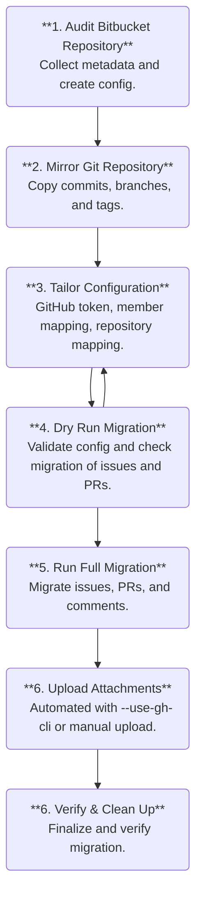

---
hide:
  - navigation
#   - toc
---

# Bitbucket → GitHub Migration Guide

**Version:** 2.0  **Last Updated:** 2025-10-18

---

## Overview

This guide explains how to migrate a **Bitbucket** Cloud repository to **GitHub**, preserving:

* Git history (branches, tags, commits)
* Issues, pull requests, and comments
* Attachments (manual upload required)
* Author and timestamp metadata (as text)

---

!!! warning "Important Safety Note"
    Keep your Bitbucket repository intact (potentially archived) until migration is fully verified. If errors occur and migration is only partially completed, delete the GitHub repository and start fresh.

---

## Migration Workflow Overview

### Single Repository Migration

For migrating a single repository, follow the standard workflow shown in the migration steps diagram below. This creates all issues/PRs with proper same-repository links and completes the migration in one pass.

### Multi-Repository Migration (Two-Phase Workflow)

When migrating multiple repositories that reference each other, use the **two-phase workflow**:

**Phase 1: Repository Migration**
- Migrate each repository individually
- Creates all issues/PRs with correct same-repository links
- Cross-repository links remain as Bitbucket URLs (tracked for Phase 2)
- Generates `cross_repo_mappings.json` with issue/PR number mappings

**Phase 2: Cross-Repository Link Updates**
- Re-run migration with `--update-links-only` flag
- Updates ONLY cross-repository links using mappings from all repositories
- No new issues/PRs created - only existing content modified

This approach ensures cross-repository references work correctly while maintaining migration efficiency.

---

## Installation and Setup

1. **Install from PyPI** (Recommended):
    ```bash
    pipx install bitbucket-migration
    ```
    Then use as follows. See [CLI Reference Guide](reference/cli_reference.md) for detailed description
    of the command line interface of the included scripts.
    ```bash
    migrate_bitbucket_to_github audit --workspace YOUR_WORKSPACE --repo YOUR_REPO
    migrate_bitbucket_to_github dry-run --config migration_config.json
    ```

    ??? "Alternative installation methods"

        **Run Directly**
        ```bash
        pipx run bitbucket-migration migrate_bitbucket_to_github audit --workspace YOUR_WORKSPACE --repo YOUR_REPO
        ```

        **From Source**
        ```bash
        git clone https://github.com/fkloosterman/bitbucket-migration.git
        cd bitbucket-migration
        python migrate_bitbucket_to_github.py audit --workspace YOUR_WORKSPACE --repo YOUR_REPO
        ```

2. **Set up Bitbucket and Github Tokens**

    You will need a Bitbucket Cloud API Token (read access to repos, issues, PRs) and
    a GitHub Personal Access Token (PAT) with `repo` scope.
    
    See [API Tokens Setup Guide](reference/api_tokens.md)
    for instructions on how to setup these tokens and to verify access.

---

## Migration Steps



---

## Step-by-Step Migration

### Step 1 — Run Audit

Generates the initial configuration and user mapping.

```bash
migrate_bitbucket_to_github audit \
  --workspace WORKSPACE \
  --repo REPO \
  --email YOU@DOMAIN \
  --gh-owner GITHUB_USER \
  --gh-repo REPO
```

**Outputs**

* `audit_report.md` – summary of repo data
* `migration_config.json` – template for migration
* `user_mapping_template.txt` – list of contributors

**Next:** Edit the config file to map Bitbucket users to GitHub accounts.
See [User Mapping Reference](reference/user_mapping.md).

---

### Step 2 — Mirror Repository

1. Create an **empty** repository on GitHub.
   Do *not* add a README or license.
2. Keep it **private** until migration is complete.

```bash
git clone --mirror https://bitbucket.org/WORKSPACE/REPO.git
cd REPO.git
git remote add github https://github.com/OWNER/REPO.git
git push --mirror github
```

Verify:

```bash
git ls-remote github
```

---

### Step 3 - Tailor Configuration

Edit `migration_config.json` to set your tokens and user mappings. See [Migration Config Reference](reference/migration_config.md) for full details.

1. **Update Tokens**
    - Set `bitbucket.token` to your Bitbucket API token.
    - Set `github.token` to your GitHub PAT with `repo` scope.

2. **Configure User Mapping**
    - Map Bitbucket display names to GitHub usernames in `user_mapping`.
    - Set unmapped or deleted users to `null`.

3. **Configure Repository Mapping (Multi-Repo Only)**
    - For multi-repository migrations, add `repository_mapping` to map Bitbucket workspace/repo to GitHub owner/repo.
    - This enables cross-repository link rewriting in Phase 2.

4. **Run Dry Run**
    - After editing, run a dry run (Step 4) to validate.
    - Refine mappings if needed.

??? "Advanced Options"
    - Add `repository_mapping` for cross-repository link rewriting.
    - See [Migration Config Reference](reference/migration_config.md) for details.

---

### Step 4 — Dry Run Migration

Run a simulation of the migration to validate your configuration without making any changes.

```bash
migrate_bitbucket_to_github dry-run \
  --config migration_config.json
```

**What it does:**
- Validates tokens and permissions.
- Checks user mappings and repository access.
- Estimates issue/PR counts and migration time.
- Generates `migration_report_dry_run.md` with details.

**Check for:**
- Authentication success (no 401/403 errors).
- Valid user mappings (no unmapped users warnings).
- Correct counts matching your audit report.
- If issues, refine `migration_config.json` and retry.

??? "Advanced Options"
    - Use `--skip-issues` or `--skip-prs` to test specific phases.
    - See [CLI Reference](reference/cli_reference.md) for all options.

---

### Step 5 — Run Full Migration

Execute the actual migration of issues, PRs, comments, and attachments.

```bash
migrate_bitbucket_to_github migrate \
  --config migration_config.json
```

**What it does:**
- Migrates issues and PRs (open PRs stay as PRs; closed PRs become issues).
- Downloads attachments to `attachments_temp/`.
- Generates `migration_mapping.json` for ID cross-references.
- Creates `migration_report.md` with details and any issues.
- **For multi-repo Phase 1**: Saves mappings to `cross_repo_mappings.json` and reports deferred cross-repo links.

??? "Advanced Options"
    - Use `--use-gh-cli` for automatic attachment upload.
    - Use `--skip-issues` or `--skip-prs` to migrate selectively.
    - For **Phase 2 cross-repo link updates**: Use `--update-links-only` (see Multi-Repository Migration section).
    - See [CLI Reference](reference/cli_reference.md) for all options.

---

### Step 6 — Upload Attachments

Attachments are downloaded locally because GitHub’s API doesn’t support direct upload. Use the `--use-gh-cli` option in the migration script for automated upload, or follow the manual steps below.

#### Automated Upload (Recommended)

Add `--use-gh-cli` to the migration command for automatic attachment upload:

```bash
migrate_bitbucket_to_github migrate --config migration_config.json --use-gh-cli
```

This requires GitHub CLI installed and authenticated.

#### Manual Upload

1. **Locate Files**
    ```bash
    cd attachments_temp/
    ls -lh
    ```

2. **Identify Targets**
    Check GitHub issues for comments like:
    ```markdown
    📎 **Attachment from Bitbucket**: `file.png` (size)
    ```

3. **Upload**
    - Drag and drop files into issue comments on GitHub.
    - Files preview inline or as links.

4. **Verify**
    - Confirm uploads in GitHub issues.

??? "Advanced Options"
    For bulk uploads or prioritization:

    **Bulk Upload with GitHub CLI**
    ```bash
    gh auth login
    cd attachments_temp
    while IFS=',' read -r file issue_num; do
      gh issue comment "$issue_num" --repo OWNER/REPO --body "**Attachment:** $file" --attach "$file"
      sleep 2
    done < attachment_mapping.csv
    ```

    **Prioritization**
    | Priority | Files | Action |
    |----------|-------|--------|
    | Critical | Screenshots, docs | Upload first |
    | Optional | Old files | Skip if needed |

    **Tracking & Cleanup**
    - Create `attachment-status.md` for progress.
    - Backup: `tar -czf attachments_backup.tar.gz attachments_temp/`
    - Delete: `rm -rf attachments_temp/` after verification.

---

### Step 7 — Verify and Clean Up

Confirm migration success and finalize the process.

**Essential Checks:**

- Verify Git history: branches, tags, and commits match Bitbucket.
- Check issue/PR counts and content against audit report.
- Spot-check user mentions, comments, and timestamps.
- Confirm attachments are uploaded (if not using --use-gh-cli).

**Clean-Up Operations:**

- Update README with new GitHub links and branch protections.
- Set Bitbucket repo to read-only or archive it.
- **Clean up migration files**: Use `migrate_bitbucket_to_github clean` to remove generated files.
- Archive migration reports and mappings for reference.

### Enhanced Clean Command

The `clean` subcommand removes output files generated during migration:

```bash
# Remove all generated files except configuration
migrate_bitbucket_to_github clean

# Remove everything including configuration files
migrate_bitbucket_to_github clean --all

# Clean specific repository outputs
migrate_bitbucket_to_github clean --workspace myworkspace --repo myrepo
```

**What gets cleaned:**
- Audit reports (`audit_report.md`, `bitbucket_audit_report.json`)
- Migration logs and reports (`migration_*.md`, `migration_*.json`)
- Temporary directories (`attachments_temp/`)
- **Keeps**: Configuration files (unless `--all` is used)

---

## Multi-Repository Migration

For organizations migrating multiple interconnected repositories, follow this two-phase workflow to ensure cross-repository links work correctly.

### Phase 1: Migrate All Repositories

Migrate each repository individually, building the shared mapping file:

```bash
# Migrate first repository
migrate_bitbucket_to_github migrate --config config-repo-a.json

# Migrate second repository (appends to cross_repo_mappings.json)
migrate_bitbucket_to_github migrate --config config-repo-b.json

# Migrate additional repositories...
migrate_bitbucket_to_github migrate --config config-repo-c.json
```

**What happens in Phase 1:**
- ✅ All issues/PRs created with correct same-repository links
- ⚠️ Cross-repository links remain as Bitbucket URLs
- 📄 `cross_repo_mappings.json` created/updated with issue/PR mappings
- 📊 Migration reports show deferred cross-repo links

### Phase 2: Update Cross-Repository Links

After all repositories are migrated, update cross-repository links:

```bash
# Update cross-repo links for each repository
migrate_bitbucket_to_github migrate --config config-repo-a.json --update-links-only
migrate_bitbucket_to_github migrate --config config-repo-b.json --update-links-only
migrate_bitbucket_to_github migrate --config config-repo-c.json --update-links-only
```

**What happens in Phase 2:**
- 🔍 Finds issues/PRs with cross-repo Bitbucket links
- ✏️ Updates ONLY those links using `cross_repo_mappings.json`
- ✅ No new issues/PRs created
- 📊 Reports show successfully updated cross-repo links

### Cross-Repository Mappings File

The `cross_repo_mappings.json` file coordinates link rewriting across repositories:

```json
{
  "workspace/repo-a": {
    "issues": { "1": 5, "2": 6, "10": 15 },
    "prs": { "1": 7, "3": 8 }
  },
  "workspace/repo-b": {
    "issues": { "5": 12, "8": 14 },
    "prs": { "2": 9 }
  }
}
```

This file is automatically managed - you don't need to edit it manually.

### Configuration for Multi-Repository Migration

Each repository's `migration_config.json` needs `repository_mapping`:

```json
{
  "bitbucket": {
    "workspace": "workspace",
    "repo": "repo-a"
  },
  "github": {
    "owner": "myorg",
    "repo": "repo-a-github"
  },
  "repository_mapping": {
    "workspace/repo-b": "myorg/repo-b-github",
    "workspace/repo-c": "myorg/repo-c-github"
  },
  "user_mapping": { ... }
}
```

---

### Support Resources

* [GitHub REST API Documentation](https://docs.github.com/en/rest)
* [Bitbucket Cloud API Documentation](https://developer.atlassian.com/cloud/bitbucket/rest/)
* [GitHub Support](https://support.github.com)

### Checklist Before Asking for Help

* Confirm both API tokens are active and scoped correctly
* Compare audit vs. migrated item counts
* Check `migration_mapping.json` for missing IDs
* Search console logs for `ERROR` or `429`
* Verify no network or disk errors occurred

If problems persist, open a support ticket with a description of the error and the script version.

---

## 📚 References

* [Migration Config Reference](reference/migration_config.md)
* [Migration Details Reference](reference/migration_details.md)
* [CLI Reference](reference/cli_reference.md)
* [User Mapping Guide](reference/user_mapping.md)
* [API Token Setup](reference/api_tokens.md)


