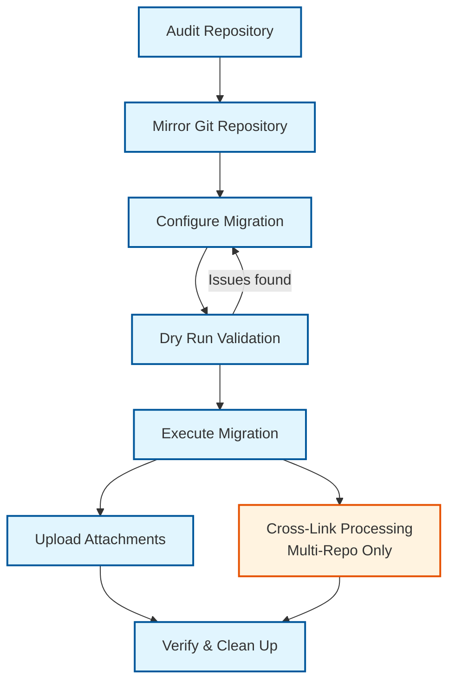

---
hide:
  - navigation
#   - toc
---

# Bitbucket → GitHub Migration Guide

**Version:** 1.0  **Last Updated:** 2025-11-05

---

## Overview

This guide explains how to migrate a **Bitbucket** Cloud repository to **GitHub**, preserving:

* Git history (branches, tags, commits)
* Issues, pull requests, and comments
* Attachments (manual upload required)
* Author and timestamp metadata (as text)

---

!!! warning "Important Safety Note"
    Keep your Bitbucket repository intact (potentially archived) until migration is fully verified. If errors occur and migration is only partially completed, delete the GitHub repository and start fresh.

---

## Migration Workflow Overview

This guide covers both single and multi-repository migrations. The basic workflow is the same for all cases, with additional steps for multi-repository scenarios.

### Standard Migration Workflow

1. **Audit Repository** - Analyze the repository and generate configuration
2. **Mirror Git Repository** - Copy commits, branches, and tags to GitHub
3. **Configure Migration** - Update tokens, user mappings, and settings
4. **Dry Run Validation** - Test the migration without making changes
5. **Execute Migration** - Migrate issues, PRs, comments, and attachments
6. **Upload Attachments** - Handle file attachments (automated or manual)
7. **Verify and Clean Up** - Confirm success and clean up temporary files

### Multi-Repository Migration (Two-Phase)

For migrating multiple repositories that reference each other:

**Phase 1: Repository Migration**

- Migrate each repository individually
- Creates all issues/PRs with correct same-repository links
- Cross-repository links remain as Bitbucket URLs (tracked for Phase 2)
- Generates `cross_repo_mappings.json` with issue/PR number mappings

**Phase 2: Cross-Repository Link Updates**

- **Run only after ALL repositories are migrated**
- Use the `cross-link` subcommand
- Updates ONLY cross-repository links using mappings from all repositories
- No new issues/PRs created - only existing content modified

---

## Installation and Setup

1. **Install from PyPI** (Recommended):
     ```bash
     pipx install bitbucket-migration
     ```
     Then use as follows. See [CLI Reference Guide](reference/cli_reference.md) for detailed description
     of the command line interface of the included scripts.
     ```bash
     migrate_bitbucket_to_github audit --workspace YOUR_WORKSPACE --repo YOUR_REPO
     migrate_bitbucket_to_github migrate --config migration_config.json --dry-run
     ```

    ??? "Alternative installation methods"

        **Run Directly**
        ```bash
        pipx run bitbucket-migration migrate_bitbucket_to_github audit --workspace YOUR_WORKSPACE --repo YOUR_REPO
        ```

        **From Source**
        ```bash
        git clone https://github.com/fkloosterman/bitbucket-migration.git
        cd bitbucket-migration
        python migrate_bitbucket_to_github.py audit --workspace YOUR_WORKSPACE --repo YOUR_REPO
        ```

2. **Set up Bitbucket and Github Tokens**

    You will need a Bitbucket Cloud API Token (read access to repos, issues, PRs) and
    a GitHub Personal Access Token (PAT) with `repo` scope.
    
    See [API Tokens Setup Guide](reference/api_tokens.md)
    for instructions on how to setup these tokens and to verify access.

---

## Migration Steps



**Key Steps:**

1. **Audit Repository** - Generate configuration and analyze repository
2. **Mirror Git Repository** - Copy commits, branches, and tags
3. **Configure Migration** - Set tokens, user mappings, and settings
4. **Dry Run Validation** - Test configuration without making changes
5. **Execute Migration** - Migrate issues, PRs, comments, and attachments
6. **Upload Attachments** - Handle file attachments (automated or manual)
7. **Verify & Clean Up** - Confirm success and clean up temporary files

**Multi-Repository Only:** Cross-Link Processing updates cross-repository references after all repositories are migrated.

---

## Step-by-Step Migration

### Step 1 — Run Audit

Generates the initial configuration and user mapping.

```bash
migrate_bitbucket_to_github audit \
  --workspace WORKSPACE \
  --repo REPO \
  --email YOU@DOMAIN \
  --gh-owner GITHUB_USER \
  --gh-repo REPO
```

**For multiple repositories:**
```bash
# Auto-discover all repositories in workspace
migrate_bitbucket_to_github audit \
  --workspace WORKSPACE \
  --discover \
  --email YOU@DOMAIN \
  --gh-owner GITHUB_USER \
  --base-dir ./migration_workspace

# Or specify multiple repositories explicitly
migrate_bitbucket_to_github audit \
  --workspace WORKSPACE \
  --repo repo1 --repo repo2 --repo repo3 \
  --email YOU@DOMAIN \
  --gh-owner GITHUB_USER \
  --base-dir ./migration_workspace
```

**Generated Files**

The audit command creates several files that you will need to review and modify:

* `migration_config.json` – **Configuration file that you must customize**
  * Set your API tokens
  * Configure user mappings
  * Adjust migration options
  * Define repository mappings (for multi-repo)
* `audit_report.md` – Analysis and recommendations
* `user_mapping_template.txt` – List of contributors found

**Important:** You **must** edit `migration_config.json` before running migration. This file contains your API tokens and user mappings, and is required for the migration to work.

**Next:** Edit the config file to map Bitbucket users to GitHub accounts (see Step 3).
See [User Mapping Reference](reference/user_mapping.md).

---

### Step 2 — Mirror Repository

1. Create an **empty** repository on GitHub.
   Do *not* add a README or license.
2. Keep it **private** until migration is complete.

```bash
git clone --mirror https://bitbucket.org/WORKSPACE/REPO.git
cd REPO.git
git remote add github https://github.com/OWNER/REPO.git
git push --mirror github
```

Verify:

```bash
git ls-remote github
```

---

### Step 3 - Tailor Configuration

Edit `migration_config.json` to set your tokens and user mappings. See [Migration Config Reference](reference/migration_config.md) for full details.

1. **Update Tokens**
     - Set `bitbucket.token` to your Bitbucket API token.
     - Set `github.token` to your GitHub PAT with `repo` scope.

2. **Configure User Mapping**
     - Map Bitbucket display names to GitHub usernames in `user_mapping`.
     - Set unmapped or deleted users to `null`.

3. **Configure Repository Mapping (Multi-Repo Only)**
     - For multi-repository migrations, add `repository_mapping` to map Bitbucket workspace/repo to GitHub owner/repo.
     - This enables cross-repository link rewriting in Phase 2.
     - Each repository needs its own config file generated by audit.

4. **Run Dry Run**
     - After editing, run a dry run (Step 4) to validate.
     - Refine mappings if needed.

??? "Advanced Options"
     - Add `repository_mapping` for cross-repository link rewriting.
     - See [Migration Config Reference](reference/migration_config.md) for details.

---

### Step 4 — Dry Run Migration

Run a simulation of the migration to validate your configuration without making any changes.

```bash
migrate_bitbucket_to_github migrate --config migration_config.json --dry-run
```

**What it does:**


- Validates tokens and permissions.
- Checks user mappings and repository access.
- Estimates issue/PR counts and migration time.
- Generates `migration_report_dry_run.md` with details.

**Check for:**

- Authentication success (no 401/403 errors).
- Valid user mappings (no unmapped users warnings).
- Correct counts matching your audit report.
- If issues, refine `migration_config.json` and retry.

??? "Advanced Options"

    - Use `--skip-issues` or `--skip-prs` to test specific phases.
    - See [CLI Reference](reference/cli_reference.md) for all options.

---

### Step 5 — Run Full Migration

Execute the actual migration of issues, PRs, comments, and attachments.

```bash
migrate_bitbucket_to_github migrate \
  --config migration_config.json
```

**For multi-repository migration:**
```bash
# Phase 1: Migrate each repository
migrate_bitbucket_to_github migrate --config migration_config.json
# Repeat for each repository...

# Phase 2: Update cross-repository links (after all repos migrated)
migrate_bitbucket_to_github cross-link --config migration_config.json
# Repeat for each repository...
```

**What it does:**

- Migrates issues and PRs (open PRs stay as PRs; closed PRs become issues).
- Downloads attachments to `attachments_temp/`.
- Generates `migration_mapping.json` for ID cross-references.
- Creates `migration_report.md` with details and any issues.
- **For multi-repo Phase 1**: Saves mappings to `cross_repo_mappings.json` and reports deferred cross-repo links.

??? "Advanced Options"

    - Use `--skip-issues` or `--skip-prs` to migrate selectively.
    - For **Phase 2 cross-repo link updates**: Use separate `cross-link` subcommand.
    - See [CLI Reference](reference/cli_reference.md) for all options.

---

### Step 6 — Upload Attachments

Attachments are downloaded locally because GitHub's API doesn't support direct upload. The migration tool creates informative comments on each issue/PR indicating which attachments need to be uploaded.

#### Attachment Upload Process

1. **Locate Files**
    ```bash
    cd attachments_temp/
    ls -lh
    ```

2. **Identify Targets**
    Check GitHub issues for comments like:
    ```markdown
    📎 **Attachment from Bitbucket**: `file.png` (size)
    ```

3. **Upload**

    - Drag and drop files into issue comments on GitHub.
    - Files preview inline or as links.

4. **Verify**

    - Confirm uploads in GitHub issues.

??? "Advanced Options"
    For bulk uploads or prioritization:

    **Prioritization**

    | Priority | Files | Action |
    |----------|-------|--------|
    | Critical | Screenshots, docs | Upload first |
    | Optional | Old files | Skip if needed |

    **Tracking & Cleanup**

    - Create `attachment-status.md` for progress.
    - Backup: `tar -czf attachments_backup.tar.gz attachments_temp/`
    - Delete: `rm -rf attachments_temp/` after verification.

---

### Step 7 — Verify and Clean Up

Confirm migration success and finalize the process.

**Essential Checks:**

- Verify Git history: branches, tags, and commits match Bitbucket.
- Check issue/PR counts and content against audit report.
- Spot-check user mentions, comments, and timestamps.
- Confirm attachments are uploaded.

**Clean-Up Operations:**

- Update README with new GitHub links and branch protections.
- Set Bitbucket repo to read-only or archive it.
- **Clean up migration files**: Use `migrate_bitbucket_to_github clean` with selective filters to remove generated files.
- Archive migration reports and mappings for reference.

### Enhanced Clean Command

The `clean` subcommand removes output files generated during migration with selective filtering:

```bash
# Remove all generated files except configuration
migrate_bitbucket_to_github clean

# Remove everything including configuration files
migrate_bitbucket_to_github clean --all

# Clean specific subcommands only
migrate_bitbucket_to_github clean --subcommand audit
migrate_bitbucket_to_github clean --subcommand migrate
migrate_bitbucket_to_github clean --subcommand audit migrate cross-link

# Clean specific repository outputs (with file tracking)
migrate_bitbucket_to_github clean --workspace myworkspace --repo myrepo

# Preview cleanup without deleting
migrate_bitbucket_to_github clean --dry-run
```

**What gets cleaned:**

- `--subcommand audit`: Audit reports and outputs
- `--subcommand migrate`: Migration reports and outputs
- `--subcommand cross-link`: Cross-link reports and outputs
- `--all`: Everything including configuration files

**Default behavior**: Cleans all outputs but keeps configuration files.

---

## Multi-Repository Migration

For migrating multiple repositories that reference each other, follow this **two-phase workflow**:

### Phase 1: Migrate All Repositories

Migrate each repository individually, building the shared mapping file:

```bash
# For each repository, create a config using audit, then migrate:
migrate_bitbucket_to_github audit --workspace WORKSPACE --repo repo1 --email YOU@DOMAIN --gh-owner GITHUB_USER --gh-repo repo1
migrate_bitbucket_to_github migrate --config migration_config.json

# Repeat for each repository
migrate_bitbucket_to_github audit --workspace WORKSPACE --repo repo2 --email YOU@DOMAIN --gh-owner GITHUB_USER --gh-repo repo2
migrate_bitbucket_to_github migrate --config migration_config.json

# Continue for all repositories...
```

**What happens in Phase 1:**

- ✅ All issues/PRs created with correct same-repository links
- ⚠️ Cross-repository links remain as Bitbucket URLs
- 📄 `cross_repo_mappings.json` created/updated with issue/PR mappings
- 📊 Migration reports show deferred cross-repo links

### Phase 2: Update Cross-Repository Links (Run Only After All Repos Are Migrated)

After **ALL** repositories are successfully migrated, update cross-repository links:

```bash
# Run cross-link for each repository (use the same config files from Phase 1)
migrate_bitbucket_to_github cross-link --config migration_config.json  # For repo1
migrate_bitbucket_to_github cross-link --config migration_config.json  # For repo2
# Continue for all repositories...
```

**What happens in Phase 2:**

- **⚠️ Run this only after ALL repositories are migrated**
- 🔍 Finds issues/PRs with cross-repo Bitbucket links
- ✏️ Updates ONLY those links using `cross_repo_mappings.json`
- ✅ No new issues/PRs created
- 📊 Reports show successfully updated cross-repo links

### Configuration Requirements

Each repository's `migration_config.json` must include repository mappings for cross-repo references:

```json
{
  "bitbucket": {
    "workspace": "WORKSPACE",
    "repo": "repo-name"
  },
  "github": {
    "owner": "GITHUB_USER",
    "repo": "repo-name"
  },
  "repository_mapping": {
    "WORKSPACE/other-repo1": "GITHUB_USER/other-repo1",
    "WORKSPACE/other-repo2": "GITHUB_USER/other-repo2"
  },
  "user_mapping": { ... }
}
```

### Cross-Repository Mappings File

The `cross_repo_mappings.json` file coordinates link rewriting across repositories:

```json
{
  "workspace/repo-a": {
    "issues": { "1": 5, "2": 6, "10": 15 },
    "prs": { "1": 7, "3": 8 }
  },
  "workspace/repo-b": {
    "issues": { "5": 12, "8": 14 },
    "prs": { "2": 9 }
  }
}
```

This file is automatically managed - you don't need to edit it manually.

### Important Notes

- **Configuration**: Each repository needs its own `migration_config.json` generated by the audit command
- **Repository Mapping**: Include mappings to all other repositories in your `repository_mapping` section
- **Incremental Migration**: You can run migrate/cross-link for repositories incrementally, but cross-link should only be used after **all** repos are migrated
- **Token and User Mapping**: Set up your API tokens and user mappings in each config file

---

### Support Resources

* [GitHub REST API Documentation](https://docs.github.com/en/rest)
* [Bitbucket Cloud API Documentation](https://developer.atlassian.com/cloud/bitbucket/rest/)
* [GitHub Support](https://support.github.com)

### Checklist Before Asking for Help

* Confirm both API tokens are active and scoped correctly
* Compare audit vs. migrated item counts
* Check `migration_mapping.json` for missing IDs
* Search console logs for `ERROR` or `429`
* Verify no network or disk errors occurred

If problems persist, open a support ticket with a description of the error and the script version.

---

## 📚 References

* [Migration Config Reference](reference/migration_config.md)
* [Migration Details Reference](reference/migration_details.md)
* [CLI Reference](reference/cli_reference.md)
* [User Mapping Guide](reference/user_mapping.md)
* [API Token Setup](reference/api_tokens.md)

## 🔧 Additional Subcommands

### Test Authentication: `test-auth`

Test Bitbucket and GitHub API authentication before migration:

```bash
migrate_bitbucket_to_github test-auth --workspace WORKSPACE --repo REPO --email EMAIL --gh-owner OWNER --gh-repo REPO
```

### Cross-Link Processing: `cross-link`

Update cross-repository links after migration:

```bash
migrate_bitbucket_to_github cross-link --config migration_config.json
```

### Clean Up: `clean`

Remove generated files with selective filtering:

```bash
migrate_bitbucket_to_github clean --subcommand audit migrate
```


