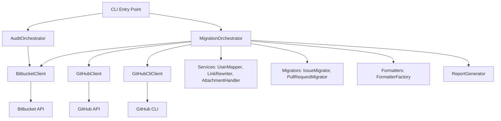

---
hide:
   - navigation
#   - toc
---

# Architecture Reference

This document describes the architecture of the bitbucket_migration package, providing developers with an understanding of the main components, their responsibilities, and how they interact.

## Introduction

The bitbucket_migration package uses a modular, orchestrator-based architecture to handle the migration process from Bitbucket to GitHub. The design emphasizes separation of concerns, with specialized components for API interactions, data processing, and migration logic. This allows for easy testing, maintenance, and extension.

Key design principles:

- **Modularity**: Each component has a single responsibility.
- **Orchestration**: A central coordinator manages the workflow.
- **Security**: Secure handling of API tokens and configuration.
- **Extensibility**: Services and formatters can be easily added or modified.

## High-Level Architecture

## Main Components

### Core Orchestrators
- **MigrationOrchestrator** (`src/bitbucket_migration/core/orchestrator.py`): Central coordinator for the migration process. Initializes components, fetches data, executes migrations, and generates reports.
- **AuditOrchestrator** (`src/bitbucket_migration/audit/audit_orchestrator.py`): Handles pre-migration analysis, generating audit reports and configuration templates.

### API Clients
- **BitbucketClient** (`src/bitbucket_migration/clients/bitbucket_client.py`): Interfaces with Bitbucket API for fetching issues, PRs, milestones, etc.
- **GitHubClient** (`src/bitbucket_migration/clients/github_client.py`): Interfaces with GitHub API for creating issues, PRs, comments, etc.
- **GitHubCliClient** (`src/bitbucket_migration/clients/github_cli_client.py`): Wraps GitHub CLI for attachment uploads and authentication checks.

### Services
- **UserMapper** (`src/bitbucket_migration/services/user_mapper.py`): Maps Bitbucket users to GitHub accounts, resolving account IDs.
- **LinkRewriter** (`src/bitbucket_migration/services/link_rewriter.py`): Rewrites cross-references between issues and PRs to point to GitHub.
- **AttachmentHandler** (`src/bitbucket_migration/services/attachment_handler.py`): Downloads attachments from Bitbucket and uploads to GitHub (via CLI or manual).

### Migrators
- **IssueMigrator** (`src/bitbucket_migration/migration/issue_migrator.py`): Handles migration of issues, including comments and attachments.
- **PullRequestMigrator** (`src/bitbucket_migration/migration/pr_migrator.py`): Migrates PRs, deciding whether to create GitHub PRs or issues based on branch existence and status.

### Formatters and Reports
- **FormatterFactory** (`src/bitbucket_migration/formatters/formatter_factory.py`): Creates formatters for content (e.g., Markdown, HTML).
- **ReportGenerator** (`src/bitbucket_migration/migration/report_generator.py`): Generates migration reports and mappings.

### Configuration and Utilities
- **MigrationConfig** (`src/bitbucket_migration/config/migration_config.py`): Data structures for configuration.
- **SecureConfigLoader** (`src/bitbucket_migration/config/secure_config.py`): Loads configuration securely, supporting environment variables.
- **Logging and Exceptions**: Custom logging (`utils/logging_config.py`) and exceptions (`exceptions.py`) for error handling.

## Interactions and Data Flow

1. **CLI Invocation**: User runs commands like `migrate` or `audit` via the main script.
2. **Orchestrator Setup**: MigrationOrchestrator initializes clients, services, and migrators based on config.
3. **Data Fetching**: BitbucketClient fetches issues, PRs, milestones from Bitbucket API.
4. **Processing**: UserMapper builds mappings, LinkRewriter updates references, AttachmentHandler downloads files.
5. **Migration Execution**: IssueMigrator and PullRequestMigrator create content on GitHub via GitHubClient.
6. **Reporting**: ReportGenerator produces summaries and mappings.
7. **Attachment Handling**: If enabled, GitHubCliClient uploads attachments.

The orchestrator ensures sequential execution, with error handling and partial saves on interruption.