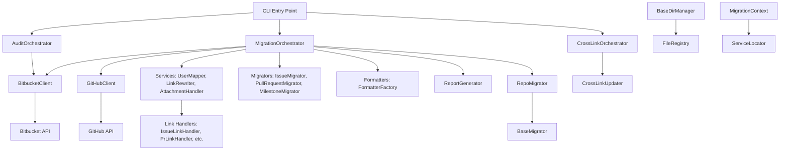

---
hide:
   - navigation
#   - toc
---

# Architecture Reference

This document describes the architecture of the bitbucket_migration package, providing developers with an understanding of the main components, their responsibilities, and how they interact.

## Introduction

The bitbucket_migration package uses a modular, orchestrator-based architecture to handle the migration process from Bitbucket to GitHub. The design emphasizes separation of concerns, with specialized components for API interactions, data processing, and migration logic. This allows for easy testing, maintenance, and extension.

Key design principles:

- **Modularity**: Each component has a single responsibility.
- **Orchestration**: A central coordinator manages the workflow.
- **Security**: Secure handling of API tokens and configuration.
- **Extensibility**: Services and formatters can be easily added or modified.

## High-Level Architecture

## Main Components

### Core Orchestrators
- **MigrationOrchestrator** (`src/bitbucket_migration/core/orchestrator.py`): Central coordinator for the migration process. Initializes components, fetches data, executes migrations, and generates reports.
- **AuditOrchestrator** (`src/bitbucket_migration/audit/audit_orchestrator.py`): Handles pre-migration analysis, generating audit reports and configuration templates.
- **CrossLinkOrchestrator** (`src/bitbucket_migration/core/orchestrator.py`): Manages cross-repository link updates after migration.
- **BaseOrchestrator** (`src/bitbucket_migration/core/orchestrator.py`): Base class providing common functionality for all orchestrators.

### API Clients
- **BitbucketClient** (`src/bitbucket_migration/clients/bitbucket_client.py`): Interfaces with Bitbucket API for fetching issues, PRs, milestones, etc.
- **GitHubClient** (`src/bitbucket_migration/clients/github_client.py`): Interfaces with GitHub API for creating issues, PRs, comments, etc.

### Services
- **UserMapper** (`src/bitbucket_migration/services/user_mapper.py`): Maps Bitbucket users to GitHub accounts, resolving account IDs.
- **LinkRewriter** (`src/bitbucket_migration/services/link_rewriter.py`): Rewrites cross-references between issues and PRs to point to GitHub.
- **AttachmentHandler** (`src/bitbucket_migration/services/attachment_handler.py`): Downloads attachments from Bitbucket and creates informative comments for manual upload.
- **CrossRepoMappingStore** (`src/bitbucket_migration/services/cross_repo_mapping_store.py`): Manages mappings between repositories for cross-repository link rewriting.
- **LinkDetector** (`src/bitbucket_migration/services/link_detector.py`): Detects and extracts URLs from text content.
- **BaseLinkHandler** (`src/bitbucket_migration/services/base_link_handler.py`): Base class for link handling with priority-based processing.
- **IssueLinkHandler** (`src/bitbucket_migration/services/issue_link_handler.py`): Handles Bitbucket issue link rewriting.
- **PrLinkHandler** (`src/bitbucket_migration/services/pr_link_handler.py`): Handles Bitbucket PR link rewriting.
- **BranchLinkHandler** (`src/bitbucket_migration/services/branch_link_handler.py`): Handles Bitbucket branch link rewriting.
- **CommitLinkHandler** (`src/bitbucket_migration/services/commit_link_handler.py`): Handles Bitbucket commit link rewriting.
- **CompareLinkHandler** (`src/bitbucket_migration/services/compare_link_handler.py`): Handles Bitbucket compare link rewriting.
- **CrossRepoLinkHandler** (`src/bitbucket_migration/services/cross_repo_link_handler.py`): Handles cross-repository link rewriting.
- **RepoHomeLinkHandler** (`src/bitbucket_migration/services/repo_home_link_handler.py`): Handles repository home page link rewriting.
- **ShortIssueRefHandler** (`src/bitbucket_migration/services/short_issue_ref_handler.py`): Handles short issue reference rewriting.

### Migrators
- **IssueMigrator** (`src/bitbucket_migration/migration/issue_migrator.py`): Handles migration of issues, including comments and attachments.
- **PullRequestMigrator** (`src/bitbucket_migration/migration/pr_migrator.py`): Migrates PRs, deciding whether to create GitHub PRs or issues based on branch existence and status.
- **MilestoneMigrator** (`src/bitbucket_migration/migration/milestone_migrator.py`): Manages migration of milestones from Bitbucket to GitHub.
- **RepoMigrator** (`src/bitbucket_migration/core/repo_migrator.py`): Orchestrates migration for individual repositories, coordinating all migrators.
- **BaseMigrator** (`src/bitbucket_migration/core/repo_migrator.py`): Base class providing common migration functionality.
- **CrossLinkMigrator** (`src/bitbucket_migration/core/repo_migrator.py`): Handles cross-repository link updates.

### Formatters and Reports
- **FormatterFactory** (`src/bitbucket_migration/formatters/formatter_factory.py`): Creates formatters for content (e.g., Markdown, HTML).
- **ReportGenerator** (`src/bitbucket_migration/migration/report_generator.py`): Generates migration reports and mappings.
- **ContentFormatter** (`src/bitbucket_migration/formatters/content_formatter.py`): Base class for content formatting.
- **IssueContentFormatter** (`src/bitbucket_migration/formatters/content_formatter.py`): Formats issue content for GitHub.
- **PullRequestContentFormatter** (`src/bitbucket_migration/formatters/content_formatter.py`): Formats PR content for GitHub.
- **CommentContentFormatter** (`src/bitbucket_migration/formatters/content_formatter.py`): Formats comment content for GitHub.

### Audit Components
- **Auditor** (`src/bitbucket_migration/audit/auditor.py`): Performs detailed audit of repositories for migration planning.
- **AuditUtils** (`src/bitbucket_migration/audit/audit_utils.py`): Utility functions for audit analysis and reporting.

### Commands
- **MigrationCommand** (`src/bitbucket_migration/commands/migration_command.py`): Handles migration command execution.
- **AuditCommand** (`src/bitbucket_migration/commands/audit_command.py`): Handles audit command execution.
- **CleanCommand** (`src/bitbucket_migration/commands/clean_command.py`): Handles cleanup command execution.
- **CrossLinkCommand** (`src/bitbucket_migration/commands/cross_link_command.py`): Handles cross-link update command execution.
- **TestAuthCommand** (`src/bitbucket_migration/commands/test_auth_command.py`): Handles authentication testing command execution.

### Configuration and Utilities
- **MigrationConfig** (`src/bitbucket_migration/config/migration_config.py`): Data structures for configuration.
- **SecureConfigLoader** (`src/bitbucket_migration/config/secure_config.py`): Loads configuration securely, supporting environment variables.
- **ConfigLoader** (`src/bitbucket_migration/config/migration_config.py`): Handles loading and validation of configuration files.
- **ConfigValidator** (`src/bitbucket_migration/config/migration_config.py`): Validates configuration data.
- **LinkRewritingConfig** (`src/bitbucket_migration/config/migration_config.py`): Configuration for link rewriting templates.
- **MigrationContext** (`src/bitbucket_migration/core/migration_context.py`): Provides context and service locator for migration operations.
- **ServiceLocator** (`src/bitbucket_migration/core/migration_context.py`): Registry for services with attribute-like access.
- **MigrationEnvironment** (`src/bitbucket_migration/core/migration_context.py`): Environment configuration and state.
- **MigrationMappings** (`src/bitbucket_migration/core/migration_context.py`): Tracks mappings between Bitbucket and GitHub entities.
- **MigrationState** (`src/bitbucket_migration/core/migration_context.py`): Current state of the migration process.
- **BaseDirManager** (`src/bitbucket_migration/utils/base_dir_manager.py`): Manages base directory structure and file operations.
- **FileRegistry** (`src/bitbucket_migration/utils/file_registry.py`): Tracks and manages migration-related files with locking.
- **MigrationLogger** (`src/bitbucket_migration/utils/logging_config.py`): Custom logging configuration for migration operations.
- **Logging and Exceptions**: Custom logging (`utils/logging_config.py`) and exceptions (`exceptions.py`) for error handling.

## Interactions and Data Flow

1. **CLI Invocation**: User runs commands like `migrate`, `audit`, `cross-link`, or `clean` via the main script.
2. **Orchestrator Setup**: Appropriate orchestrator (MigrationOrchestrator, AuditOrchestrator, CrossLinkOrchestrator) initializes components based on config.
3. **Configuration Loading**: SecureConfigLoader loads and validates configuration, supporting environment variables.
4. **Repository Setup**: BaseDirManager and FileRegistry manage directory structure and file tracking.
5. **Data Fetching**: BitbucketClient fetches issues, PRs, milestones, comments, and attachments from Bitbucket API.
6. **User Mapping**: UserMapper builds account ID mappings from fetched data.
7. **Milestone Migration**: MilestoneMigrator creates corresponding milestones on GitHub.
8. **Content Processing**: Formatters convert Bitbucket content to GitHub-compatible format.
9. **Link Rewriting**: LinkRewriter processes content using various LinkHandlers to update references.
10. **Migration Execution**: RepoMigrator coordinates IssueMigrator and PullRequestMigrator to create content on GitHub.
11. **Cross-Repository Linking**: CrossRepoMappingStore and CrossRepoLinkHandler manage links between repositories.
12. **Attachment Handling**: AttachmentHandler downloads from Bitbucket and creates informative comments for manual upload.
13. **Reporting**: ReportGenerator produces summaries, mappings, and audit reports.
14. **Post-Migration Updates**: CrossLinkUpdater can update links after all migrations are complete.

The orchestrator ensures sequential execution, with error handling and partial saves on interruption.